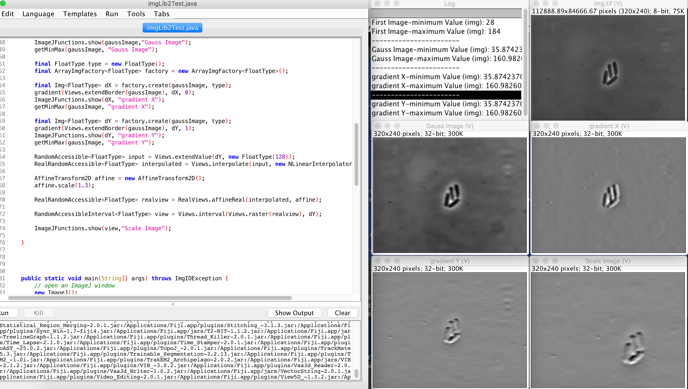

# **imglib2 Test** 
Discovering imgLib2 features via simple example

Overview
---
For my first use of imgLib2 and imageJ
I implemented a bit of code which aim to help to identify bacteria via application of some filters such as:
Gauss, scaling and gradient in both directions
I used this [Source Video](https://www.youtube.com/watch?v=gEwzDydciWc)
to get the image

Screenshot
---

---

Credit to: Stephan Preibisch
---

Name: Marwan ZOUINKHI
email: zouinkhi.marwan@gmail.com
